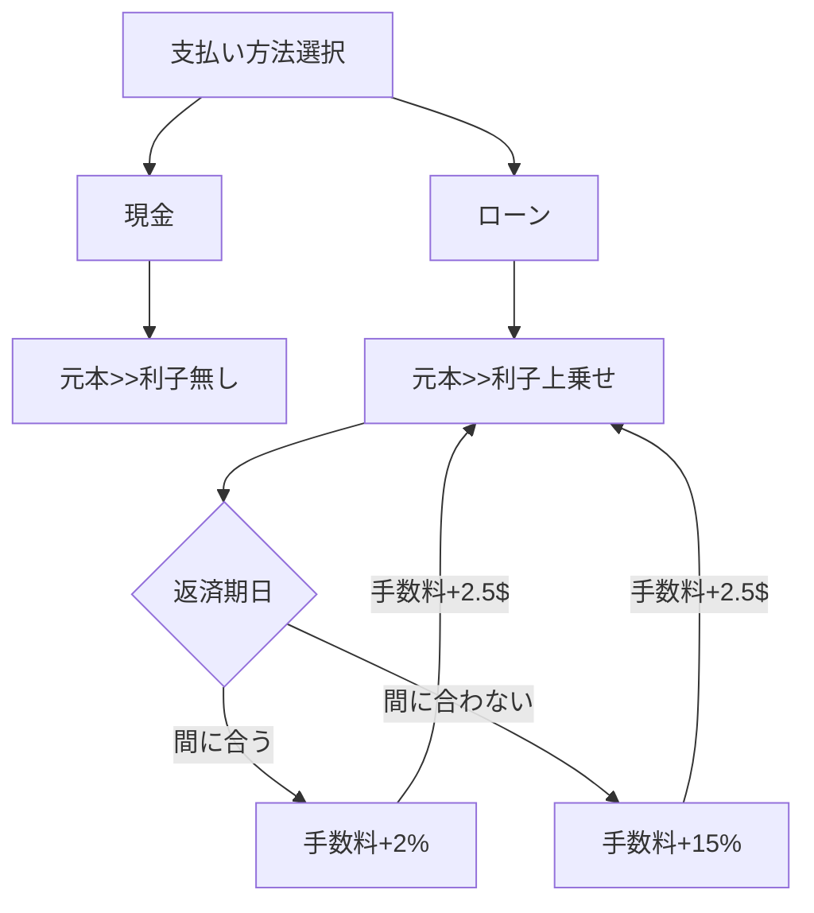

## How to Flow Chart

支払い方法としてローンを選択すると利子が元の金額に上乗せ
期日までに払われた場合利子は 2% で払われなかった場合利子は 15%
また、どちらの場合でも手数料は $2.5 かかる
ローンの金額 initialLoan 期日までに払われたかどうかをブーリアンで表した
didPayOnTime を入力として受け取り、合計金額を返す interestsPaid という関数を作成せよ

