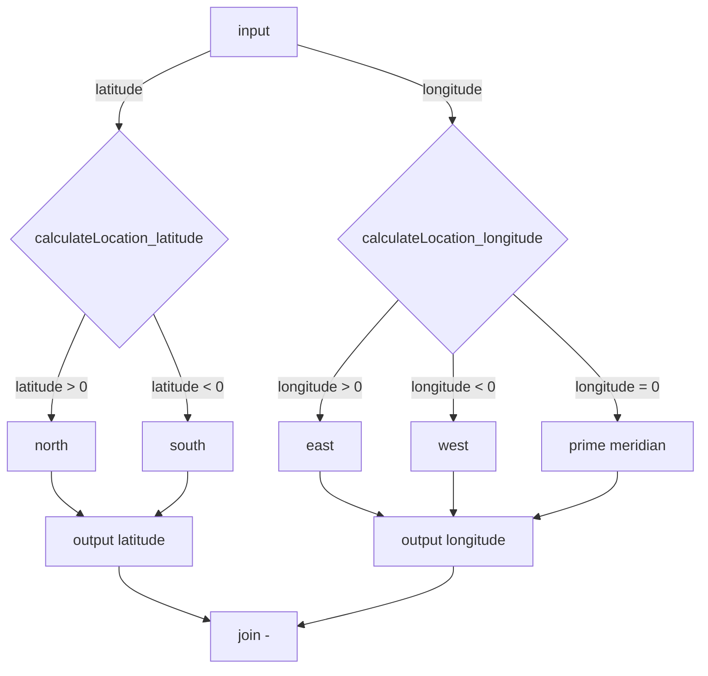

```mermaid
  flowchart TD
  A[input] -->|latitude| B{calculateLocation_latitude}
  B --> |latitude > 0| C[north]
  B --> |latitude < 0| D[south]

  A --> |longitude| G{calculateLocation_longitude}
  G --> |longitude > 0| E[east]
  G --> |longitude < 0| F[west]
  G --> |longitude = 0| H[prime meridian]

  C --> I[output latitude]
  D --> I[output latitude]

  E --> J[output longitude]
  F --> J[output longitude]
  H --> J[output longitude]

  I --> K[ join - ]
  J --> K[ join - ]

```